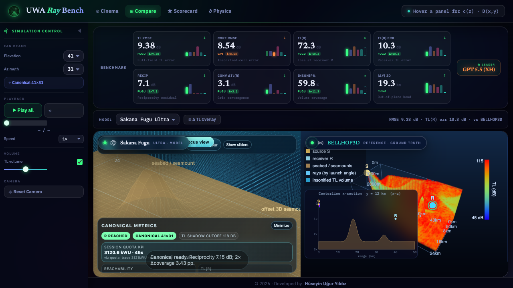

<p align="center">
  
</p>

<h1 align="center">Underwater Acoustic Ray Bench</h1>

<p align="center"><b>Five LLMs, one physics prompt, one ground truth.</b></p>
<p align="center">Trace the rays. Refract through the profile. Bounce off the seabed. Score against BELLHOP3D.</p>

<p align="center">
  
  
  
  
  
  
  
  
  
  
  <a href="https://uwa-ray-bench.vercel.app/"></a>
</p>

<p align="center">
  <a href="https://uwa-ray-bench.vercel.app/">Live site</a> ·
  <a href="#results">Results</a> ·
  <a href="#how-the-benchmark-works">How it works</a> ·
  <a href="#architecture">Architecture</a> ·
  <a href="#running-locally">Run locally</a> ·
  <a href="#project-rules">Project rules</a>
</p>

---

<p align="center">
  
</p>

## What this is

Five LLMs — **Fugu Ultra**, **Opus 4.8 (max)**, **GPT 5.5 (Extra High)**,
**Gemini 3.1 Pro (High)**, and **Fable 5 (Max)** — each received the exact same
[verbatim prompt](docs/model_prompt.md) in a separate, isolated session: trace a fan of
1,271 rays from a source through a synthetic 3D ocean (depth-dependent sound-speed
profile, two offset seamounts), refract them correctly, bounce them off the sloped
seabed, and report where the sound does — and doesn't — reach.

None of the models saw each other's output, the reference implementation, or the scoring
code. Each produced one `ray_view.html`, dropped unmodified into this harness as an
opaque `<iframe>`. A real **BELLHOP3D** run (genuine 3D, not an Nx2D approximation) sits
alongside them as ground truth.

The harness scores every panel the same way: each one posts its own computed
transmission-loss (TL) field on an identical 101×49×31 grid, and the harness compares
that field to BELLHOP3D. **Comparison is on data, not pixels** — the models can render
however they like; the verdict comes from the numbers they export.

## Results

At the canonical operating point (41 elevation beams × 31 azimuth beams = 1,271 rays),
ranked by **core RMSE** — TL error over the insonified region, the primary scoring
metric per the [benchmark spec](docs/benchmark_spec.md):

| Rank | Model | Core RMSE vs BELLHOP3D | |
| :---: | --- | ---: | --- |
| 🥇 | **GPT 5.5 (Extra High)** | **8.54 dB** | leader |
| 🥈 | **Fable 5 (Max)** | 10.02 dB | |
| 🥉 | **Fugu Ultra** | 12.33 dB | |
| 4 | **Opus 4.8 (max)** | 12.57 dB | |
| 5 | **Gemini 3.1 Pro (High)** | 23.10 dB | |

*Captured from the latest scored run ([`tools/perf_baseline.json`](tools/perf_baseline.json)).
Core RMSE is one axis of a tiered scorecard — full-field TL RMSE, receiver-point TL(R)
error, reciprocity residual, convergence delta, insonified coverage, and 3D out-of-plane
deflection are all tracked separately and never collapsed into one number. Open the
**Scorecard** tab in the live harness for the complete, per-metric breakdown with
per-column winners highlighted.*

<p align="center">
  
</p>

## How the benchmark works

- **Snap grid:** each panel can be explored off-canonical (5×5 = 25 elevation × azimuth
  stops), but only **41×31 is scored** — a "Reset to canonical" control always exists.
- **Shared contract:** every panel emits `postMessage({type:'ray_metrics', ...})` with
  its metric-card numbers and its TL field on the canonical grid. No network calls.
- **Fairness protocol:** byte-identical prompt, isolated sessions, no shared UI mockups,
  no cross-contamination between the infra build and the model outputs — the full rules
  are in [CLAUDE.md](CLAUDE.md).
- **Physics governing the task** — eikonal equation, Hamiltonian ray equations, Snell's
  law at interfaces, geometric-spreading TL — is laid out interactively in the harness's
  **Physics** tab:

  <p align="center">
    
  </p>

## Architecture

```text
                     HARNESS CHROME  (harness/index.html + harness.js)
   ┌────────┬────────┬────────┬────────┬────────┬──────────────┐
   │ Fugu UI│ Opus UI│ GPT UI │Gemini UI│Fable UI│ Reference UI │
   │(Ultra) │(4.8max)│(5.5 XH)│(3.1 Pro)│  (5)   │ (BELLHOP3D)  │
   └────────┴────────┴────────┴────────┴────────┴──────────────┘
     opaque <iframe>s, each rendering its own vanilla-JS + WebGL scene
```

- **Harness** (`harness/`) — the shared chrome: Gallery / Compare / Scorecard / Physics
  tabs, the Simulation Control sidebar, live scoring, and the shared dark-glassmorphism
  design system.
- **Reference** (`reference/`) — renders the precomputed BELLHOP3D ground truth with the
  same visual language as the harness; data is precomputed offline per snap-grid combo
  (`reference/data/<elev>x<azim>.bin`) by `reference/bellhop3d/compute_reference.py`.
- **Models** (`models/<id>/ray_view.html`) — five opaque, untouched model outputs.
- **Tools** (`tools/`) — `perf_check.mjs`, a zero-dependency Chrome-DevTools-Protocol
  performance and regression probe (FPS, heap, live-iframe count, canonical scores vs.
  a golden baseline).

## Running locally

Everything is static — no build step, no server-side code:

```bash
# any static file server works, e.g.:
npx serve .
# → open http://localhost:3000/harness/
```

Deploys as-is to Vercel (`vercel.json` rewrites `/` → `/harness/index.html`).

## Regenerating the reference or re-scoring

```bash
# reference (genuine 3D BELLHOP3D, native arm64 Python)
python3 -c "import platform; print(platform.machine())"   # must print arm64
cd reference/bellhop3d && python3 compute_reference.py

# performance + canonical-score regression check
node tools/perf_check.mjs                 # real-GPU run against a local static server
node tools/perf_check.mjs --url <URL>      # check a deployed URL
node tools/perf_check.mjs --update-baseline
```

## Project rules

The fairness and isolation rules that keep this comparison meaningful — and the shared
design system, mobile-portrait requirements, and data contract — are documented in
[CLAUDE.md](CLAUDE.md) and [docs/benchmark_spec.md](docs/benchmark_spec.md).

---

<p align="center">© 2026 · Developed by Hüseyin Uğur Yıldız</p>
