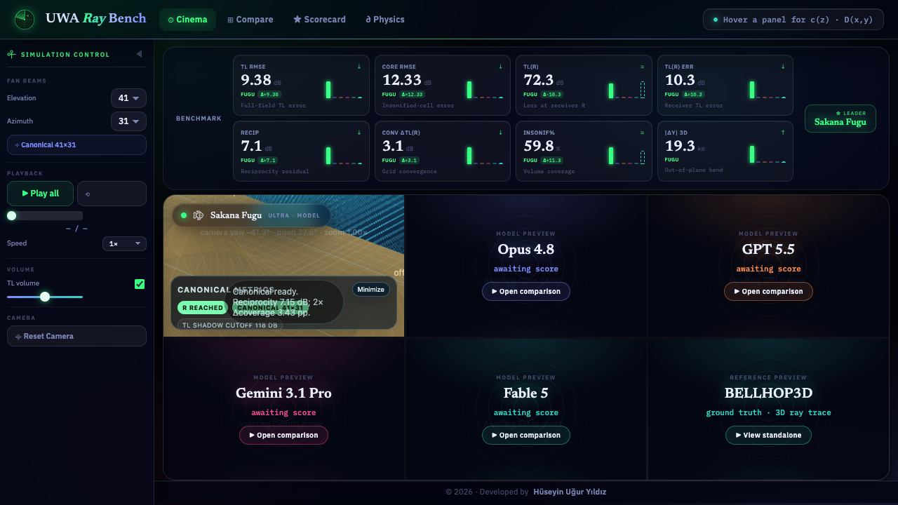
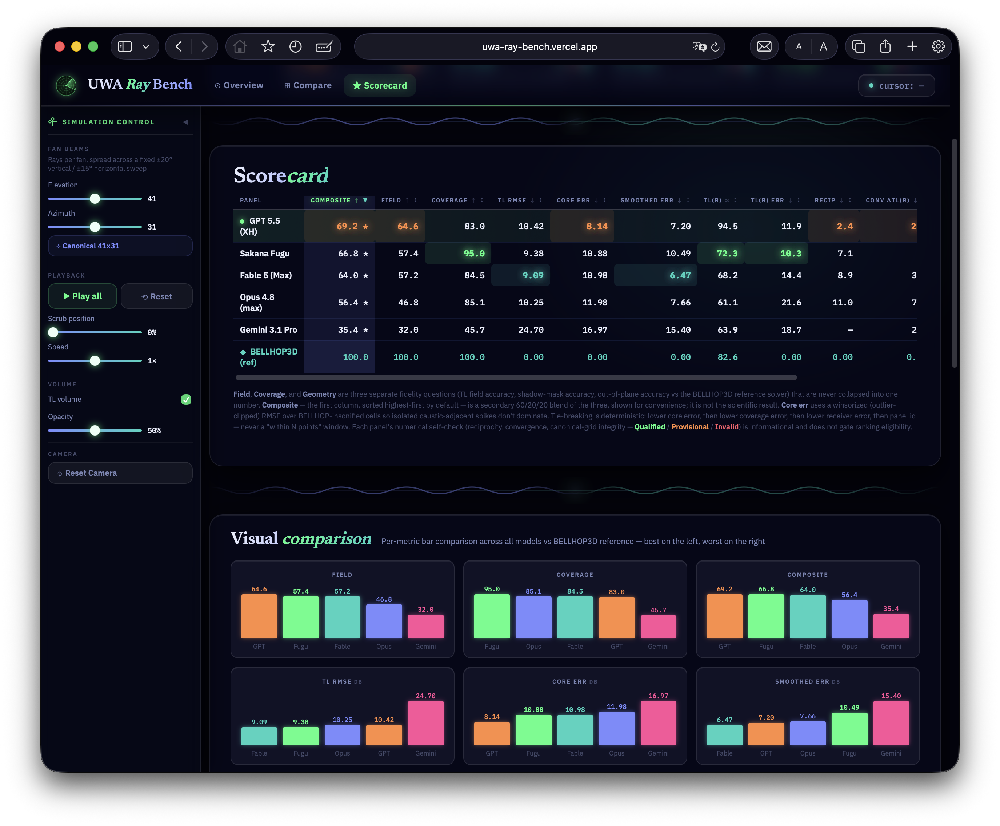

<p align="center">
  
</p>

<h1 align="center">Underwater Acoustic Ray Bench</h1>

<p align="center"><b>Five LLMs, one physics prompt, one BELLHOP3D reference solver.</b></p>
<p align="center">Trace the rays. Refract through the profile. Bounce off the seabed. Score against BELLHOP3D.</p>

<p align="center">
  
  
  
  
  
  
  
  
  <a href="https://uwa-ray-bench.vercel.app/"></a>
</p>

<p align="center">
  <a href="#results">Results</a> ·
  <a href="#how-the-benchmark-works">How it works</a> ·
  <a href="#architecture">Architecture</a> ·
  <a href="#running-locally">Run locally</a> ·
  <a href="#project-rules">Project rules</a>
</p>

---

<p align="center">
  
</p>

## What this is

Five LLMs — **Fugu Ultra**, **Opus 4.8 (max)**, **GPT 5.6 Sol (Ultra)**,
**Gemini 3.1 Pro (High)**, and **Fable 5 (Max)** — each received the exact same
[verbatim prompt](docs/model_prompt.md) in a separate, isolated session: trace a fan of
1,271 rays from a source through a synthetic 3D ocean (depth-dependent sound-speed
profile, two offset seamounts), refract them correctly, bounce them off the sloped
seabed, and report where the sound does — and doesn't — reach.

None of the models saw each other's output, the reference implementation, or the scoring
code. Each produced one `ray_view.html`, dropped unmodified into this harness as an
opaque `<iframe>`. A real **BELLHOP3D** run (genuine 3D, not an Nx2D approximation) sits
alongside them as the reference solver — not "ground truth," and not the sole verdict:
scoring separates field, coverage, and geometry fidelity (see [Results](#results)).

The harness scores every panel the same way: each one posts its own computed
transmission-loss (TL) field on an identical 101×49×31 grid, and the harness compares
that field to BELLHOP3D. **Comparison is on data, not pixels** — the models can render
however they like; the verdict comes from the numbers they export.

## Results

Scoring separates three fidelity questions instead of collapsing them into one
number — see [docs/benchmark_spec.md § Scoring note](docs/benchmark_spec.md#scoring-note)
for the full formulas. This section reports the latest canonical (41×31) run:

| Rank | Model | Composite | Field | Coverage |
| :---: | --- | ---: | ---: | ---: |
| 🥇 | **GPT 5.6 Sol (Ultra)** | **71.3** \* | 62.8 | 96.7 |
| 🥈 | **Sakana Fugu (Ultra)** | 66.8 \* | 57.4 | 95.0 |
| 🥉 | **Fable 5 (Max)** | 64.0 \* | 57.2 | 84.5 |
| 4 | **Opus 4.8 (max)** | 56.4 \* | 46.8 | 85.1 |
| 5 | **Gemini 3.1 Pro (High)** | 35.4 \* | 32.0 | 45.7 |

*0–100, higher wins. `*` = **provisional composite**: Geometry Fidelity is "not
yet scored" for every panel today because the reference panel doesn't currently
emit its own out-of-plane deflection — Composite's weight
re-normalizes over Field + Coverage only until that's fixed. Since Geometry
Fidelity itself has no leader to show, the table below reports **Boundary Δ**
(shadow-boundary position error vs BELLHOP3D, computed straight from each
panel's own TL field) in its place — a real, populated diagnostic, not a
replacement for the Geometry Fidelity axis or its Composite weight. Open the
**Scorecard** tab in the live harness for the complete per-metric breakdown,
including the retained raw diagnostics (TL RMSE, TL(R), reciprocity,
convergence, insonified%, boundary distance).*

**Per-criterion leaders** — no single model wins every axis:

| Criterion | Leader |
| --- | --- |
| Field Fidelity (↑) | **GPT 5.6 Sol (Ultra)** |
| Coverage Fidelity (↑) | **GPT 5.6 Sol (Ultra)** |
| Boundary Δ (↓) | **GPT 5.6 Sol (Ultra)** |
| Composite (provisional, ↑) | **GPT 5.6 Sol (Ultra)** |
| Core err, dB (↓) | **Sakana Fugu** |
| TL RMSE, full-field, dB (↓) | **Fable 5 (Max)** |
| Smoothed err, dB (↓) | **Fable 5 (Max)** |
| TL(R) err, dB (↓) | **GPT 5.6 Sol (Ultra)** |

*Full values and the rest of the field for each criterion are in the ranking
table above and the live **Scorecard** tab.*

GPT 5.6 Sol Ultra now sweeps TL-field accuracy, coverage-mask agreement,
receiver accuracy (TL(R)), shadow-boundary position, and the overall Composite;
Fugu leads the robust core-region error; Fable leads the full-field and smoothed
diagnostics. That's the point of splitting the score: a single blended number
would have hidden this and just picked one "winner."

<p align="center">
  
</p>

## How the benchmark works

- **Snap grid:** each panel can be explored off-canonical (5×5 = 25 elevation × azimuth
  stops), but only **41×31 is scored** — a "Reset to canonical" control always exists.
- **Shared contract:** every panel emits `postMessage({type:'ray_metrics', ...})` with
  its metric-card numbers and its TL field on the canonical grid. No network calls.
- **Fairness protocol:** byte-identical prompt, isolated sessions, no shared UI mockups,
  no cross-contamination between the infra build and the model outputs — the full rules
  are in [CLAUDE.md](CLAUDE.md).
- **Physics governing the task** — eikonal equation, Hamiltonian ray equations, Snell's
  law at interfaces, geometric-spreading TL — is laid out in the
  [benchmark spec](docs/benchmark_spec.md).

## Architecture

```text
                     HARNESS CHROME  (harness/index.html + harness.js)
   ┌────────┬────────┬────────┬────────-┬────────┬──────────────┐
   │ Fugu UI│ Opus UI│ GPT UI │Gemini UI│Fable UI│ Reference UI │
   │(Ultra) │(4.8max)│(5.6 SU)│(3.1 Pro)│  (5)   │ (BELLHOP3D)  │
   └────────┴────────┴────────┴────────-┴────────┴──────────────┘
     opaque <iframe>s, each rendering its own vanilla-JS + WebGL scene
```

- **Harness** (`harness/`) — the shared chrome: Overview / Compare / Scorecard
  tabs, the Simulation Control sidebar, live scoring, and the shared dark-glassmorphism
  design system.
- **Reference** (`reference/`) — renders the precomputed BELLHOP3D reference solve with the
  same visual language as the harness; data is precomputed offline per snap-grid combo
  (`reference/data/<elev>x<azim>.bin`) by `reference/bellhop3d/compute_reference.py`.
- **Models** (`models/<id>/ray_view.html`) — five opaque, untouched model outputs.
- **Tools** (`tools/`) — `perf_check.mjs`, a zero-dependency Chrome-DevTools-Protocol
  performance and regression probe (FPS, heap, live-iframe count, canonical scores vs.
  a golden baseline).

## Running locally

Everything is static — no build step, no server-side code:

```bash
# any static file server works, e.g.:
npx serve .
# → open http://localhost:3000/harness/
```

Deploys as-is to Vercel (`vercel.json` rewrites `/` → `/harness/index.html`).

## Regenerating the reference or re-scoring

```bash
# reference (genuine 3D BELLHOP3D, native arm64 Python)
python3 -c "import platform; print(platform.machine())"   # must print arm64
cd reference/bellhop3d && python3 compute_reference.py

# performance + canonical-score regression check
node tools/perf_check.mjs                 # real-GPU run against a local static server
node tools/perf_check.mjs --url <URL>      # check a deployed URL
node tools/perf_check.mjs --update-baseline
```

## Project rules

The fairness and isolation rules that keep this comparison meaningful — and the shared
design system, mobile-portrait requirements, and data contract — are documented in
[CLAUDE.md](CLAUDE.md) and [docs/benchmark_spec.md](docs/benchmark_spec.md).

---

<p align="center">© 2026 · Developed by Hüseyin Uğur Yıldız</p>
